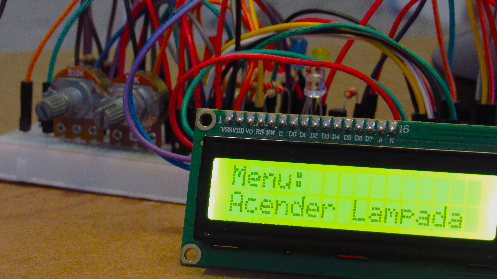
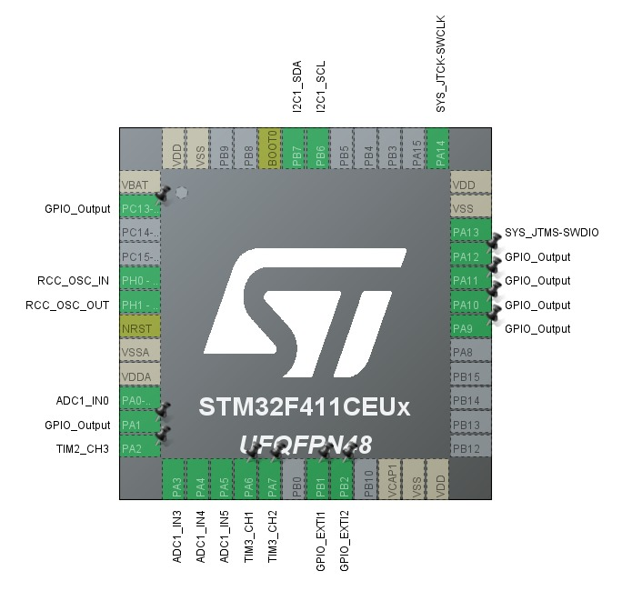

# Simulador de Termo-Higrômetro STM32

Este projeto implementa um sistema de monitoramento de temperatura e umidade usando um microcontrolador STM32F411 (Blackpill). O sistema possui:

- Medição de temperatura em Celsius e Kelvin
- Medição de umidade relativa com alertas de níveis críticos
- Controle visual com 5 LEDs
- Interface por LCD I2C e Joystick
- Controle remoto por infravermelho (protocolo NEC)
- Sistema de proteção com PWM adaptativo

## Componentes Utilizados

- STM32F411CEU6 (Blackpill)
- LCD 16x2 com I2C
- Potenciômetro de 10k Ohm para simular Temperatura
- Potenciômetro de 1k Ohm para simular Umidade
- LEDs indicadores (5 unidades)
- LEDs alerta de proteção (2 unidades)
- LED IR infra-vermelho e lâmpada RGB
- Joystick analógico
- Botões (PB1, PB2)

## Organização do Código

O código principal está em:

- `Core/Src/main.c`: lógica de controle e proteções
- `Core/Inc`: cabeçalhos
- `Drivers/`: bibliotecas HAL e customizadas (LCD, Joystick)

Bibliotecas:

- lcd encontra em arquivos .c e .h dentro de `Core`
  - créditos a https://github.com/petrhonez/stm32_hygrometer_simulator 
- joystick encontra em arquivos .c e .h dentro de `Core`

## Esquema de Menu

1. Acender Lâmpada  
2. Apagar Lâmpada  
3. Mostrar Temp (°C)  
4. Mostrar Temp (K)  
5. Mostrar Umidade (%)  
6. Luz LCD OFF  
7. Luz LCD ON  

